# CUST_CRUD – Customer Management System

A full-stack **Customer Management System** developed using **Spring Boot, React, MySQL, Spring Security, JWT, and Axios**.

The application provides customer CRUD operations, authentication, role-based authorization, pagination, customer search by ID, and exception handling.

---

## 📌 Project Overview

**CUST_CRUD** is a full-stack web application designed to manage customer information in a centralized system.

The project is based on a dealership scenario where products are supplied to different customers/dealers and their details need to be maintained regularly.

Instead of maintaining records manually, this application provides a centralized system to store, retrieve, update, and manage customer information.

### User Roles

- **ADMIN** – Can view, add, edit, and delete customer records.
- **USER** – Can view and search customer records only.

### Project Modules

- **CUST_CRUD** – Spring Boot Backend
- **CUST_UI** – React Frontend

Both modules are maintained in the same GitHub repository.

---

# ✨ Features

## 👥 Customer Management

- Create customer records
- View all customers
- Search customer by Customer ID
- View individual customer details
- Update customer information
- Delete customer records
- Pagination
- Display customer ID, name, product, price, and quantity

---

## 🔐 Authentication

- User signup
- User login
- BCrypt password encryption
- JWT-based authentication
- Token-based API authorization
- JWT token stored in browser Local Storage
- Automatic JWT attachment using Axios interceptor

---

## 👮 Role-Based Authorization

### ADMIN

- View customers
- Search customers
- View all customers
- Add customers
- Edit customers
- Delete customers

### USER

- View customers
- Search customers
- View all customers
- Cannot add customers
- Cannot edit customers
- Cannot delete customers

---

## 🚨 Error Handling

- Customer not found handling
- `401 Unauthorized` handling
- `403 Forbidden` handling
- Global exception handling

---

# 🖥️ Frontend Features

- React-based UI
- Home page
- Signup page
- Login page
- Customer list
- Search customer by ID
- View All customers
- Pagination
- Add customer page
- Edit customer page
- Protected routes
- Admin-only actions
- Axios API integration
- Login redirects to Home page after successful authentication

---

# 🛠️ Technologies Used

## Backend

| Technology | Purpose |
|---|---|
| Java | Programming Language |
| Spring Boot | Backend Framework |
| Spring MVC | REST API Development |
| Spring Data JPA | Database Operations |
| Hibernate | ORM |
| Spring Security | Authentication & Authorization |
| JWT | Token-Based Authentication |
| BCrypt | Password Encryption |
| Maven | Dependency Management |
| Lombok | Reduces Boilerplate Code |

## Frontend

| Technology | Purpose |
|---|---|
| React | Frontend UI |
| JavaScript | Programming Language |
| HTML | Page Structure |
| CSS | Styling |
| Axios | API Communication |
| React Router | Page Navigation |
| Vite | Development Tool |

## Database & Tools

| Technology | Purpose |
|---|---|
| MySQL | Database |
| MySQL Workbench | Database Management |
| Postman | API Testing |
| Git | Version Control |
| GitHub | Code Repository |
| Eclipse | Backend Development |
| VS Code | Frontend Development |

---

# 🏗️ System Architecture

```text
                    CUSTOMER MANAGEMENT SYSTEM
                              │
                              ▼
                    ┌─────────────────┐
                    │    React UI     │
                    │     CUST_UI     │
                    │    Port: 5173   │
                    └────────┬────────┘
                             │
                             │ Axios / REST API
                             ▼
                    ┌─────────────────┐
                    │   Spring Boot   │
                    │    CUST_CRUD    │
                    │    Port: 9595   │
                    └────────┬────────┘
                             │
                             ▼
                    ┌─────────────────┐
                    │ Spring Security │
                    │   + JWT Filter  │
                    └────────┬────────┘
                             │
                             ▼
                    ┌─────────────────┐
                    │   Controller    │
                    └────────┬────────┘
                             │
                             ▼
                    ┌─────────────────┐
                    │     Service     │
                    └────────┬────────┘
                             │
                             ▼
                    ┌─────────────────┐
                    │    Repository   │
                    └────────┬────────┘
                             │
                             ▼
                    ┌─────────────────┐
                    │      MySQL      │
                    │   crud_cms DB   │
                    └─────────────────┘
```

---

# 📁 Project Structure

```text
SPRING_CRUD_PROJECT/
│
├── CUST_CRUD/                         # Spring Boot Backend
│   │
│   ├── src/
│   │   ├── main/
│   │   │   ├── java/
│   │   │   │   └── com/ruthvik/CUST_CRUD/
│   │   │   │       │
│   │   │   │       ├── controller/
│   │   │   │       │   ├── AuthController.java
│   │   │   │       │   └── CustomerController.java
│   │   │   │       │
│   │   │   │       ├── exception/
│   │   │   │       │   ├── GlobalExceptionHandler.java
│   │   │   │       │   └── ResourceNotFoundException.java
│   │   │   │       │
│   │   │   │       ├── model/
│   │   │   │       │   ├── Customer.java
│   │   │   │       │   └── User.java
│   │   │   │       │
│   │   │   │       ├── repository/
│   │   │   │       │   ├── CustomerRepo.java
│   │   │   │       │   └── UserRepo.java
│   │   │   │       │
│   │   │   │       ├── security/
│   │   │   │       │   ├── JwtUtil.java
│   │   │   │       │   ├── JwtAuthenticationFilter.java
│   │   │   │       │   ├── SecurityConfig.java
│   │   │   │       │   ├── CustomAuthenticationEntryPoint.java
│   │   │   │       │   └── CustomAccessDeniedHandler.java
│   │   │   │       │
│   │   │   │       ├── service/
│   │   │   │       │   ├── AuthService.java
│   │   │   │       │   └── CustomerService.java
│   │   │   │       │
│   │   │   │       └── CustCrudApplication.java
│   │   │   │
│   │   │   └── resources/
│   │   │       └── application.properties
│   │   │
│   │   └── test/
│   │
│   └── pom.xml
│
├── CUST_UI/                           # React Frontend
│   │
│   ├── src/
│   │   ├── components/
│   │   │   ├── Navbar.jsx
│   │   │   ├── ProtectedRoute.jsx
│   │   │   └── AdminRoute.jsx
│   │   │
│   │   ├── pages/
│   │   │   ├── Home.jsx
│   │   │   ├── Signup.jsx
│   │   │   ├── Login.jsx
│   │   │   ├── CustomerList.jsx
│   │   │   ├── AddCustomer.jsx
│   │   │   └── EditCustomer.jsx
│   │   │
│   │   ├── services/
│   │   │   └── api.js
│   │   │
│   │   ├── App.jsx
│   │   ├── App.css
│   │   ├── index.css
│   │   └── main.jsx
│   │
│   ├── package.json
│   └── vite.config.js
│
├── screenshots/
│   ├── home.png
│   ├── signup.png
│   ├── login.png
│   ├── customer-search.png
│   ├── customer-list.png
│   ├── add-customer.png
│   └── edit-customer.png
│
├── .gitignore
└── README.md
```

---

# 🔄 Application Flow

After successful login, the user is redirected to the **Home Page**.

```text
USER
  ↓
React Frontend
  ↓
Signup / Login
  ↓
JWT Token Generated
  ↓
Token Stored in Browser
  ↓
Home Page
  ↓
User navigates to Customers
  ↓
Customer Management Page
  ↓
User Performs Operation
  ↓
Axios Sends Request
  ↓
Spring Boot REST Controller
  ↓
Service Layer
  ↓
Repository Layer
  ↓
MySQL Database
  ↓
Response Returned
  ↓
React UI Displays Result
```

---

# 🔐 Authentication Flow

The application uses **JWT-based authentication**.

```text
User
  ↓
Login Page
  ↓
Email + Password
  ↓
React Frontend
  ↓
POST /auth/login
  ↓
Spring Boot
  ↓
AuthService
  ↓
Find User in MySQL
  ↓
Verify Password using BCrypt
  ↓
Generate JWT
  ↓
JWT returned to React
  ↓
Token stored in Local Storage
  ↓
Axios Interceptor
  ↓
Authorization: Bearer <JWT>
  ↓
JWT Authentication Filter
  ↓
Validate Token
  ↓
Extract Email + Role
  ↓
Spring Security
  ↓
Allow / Deny Request
```

---

# 👥 Role-Based Authorization

## ADMIN

```text
ADMIN
 │
 ├── View Customers       ✅
 ├── Search by ID         ✅
 ├── View All             ✅
 ├── Add Customer         ✅
 ├── Edit Customer        ✅
 └── Delete Customer      ✅
```

## USER

```text
USER
 │
 ├── View Customers       ✅
 ├── Search by ID         ✅
 ├── View All             ✅
 ├── Add Customer         ❌
 ├── Edit Customer        ❌
 └── Delete Customer      ❌
```

---

# 🔎 Search Customer by ID

The application provides a direct search option to find a customer using the Customer ID.

```text
Find Customer by ID

[ Enter Customer ID ] [ Search ] [ View All ] [ Clear ]
```

For example:

```text
Customer ID = 105
```

The frontend sends:

```http
GET /getCust/105
```

## Search Flow

```text
React
  ↓
Axios
  ↓
Spring Security
  ↓
CustomerController
  ↓
CustomerService
  ↓
CustomerRepo
  ↓
MySQL
  ↓
Customer with ID 105
  ↓
JSON Response
  ↓
React UI
```

Only the requested customer is displayed.

---

# 📋 View All Customers

Clicking **View All** displays customer records using pagination.

```http
GET /getCustListPage?page=0&size=5
```

Example:

```text
Page 1 of 5

ID    Name       Product       Price     Quantity
--------------------------------------------------
1     Dealer A   Product X     ₹500      50
2     Dealer B   Product Y     ₹600      75
3     Dealer C   Product Z     ₹450      100
4     Dealer D   Product A     ₹800      40
5     Dealer E   Product B     ₹350      60
```

Navigation:

```text
[ Previous ]     Page 1 of 5     [ Next ]
```

The **Clear** button removes the current search/result and returns the customer page to its initial state.

---

# 🔄 Customer CRUD Flow

```text
Customer Request
       ↓
React Frontend
       ↓
Axios
       ↓
Spring Controller
       ↓
Customer Service
       ↓
Customer Repository
       ↓
MySQL
       ↓
JSON Response
       ↓
React UI
```

## Create Customer

```text
React
 ↓
POST /createCust
 ↓
Controller
 ↓
Service
 ↓
Repository
 ↓
MySQL
```

## Get All Customers

```text
React
 ↓
GET /getCustList
 ↓
Controller
 ↓
Service
 ↓
Repository
 ↓
MySQL
```

## Get Customer by ID

```text
React
 ↓
GET /getCust/{cid}
 ↓
Controller
 ↓
Service
 ↓
Repository
 ↓
MySQL
```

## Update Customer

```text
React
 ↓
PUT /updateCust/{cid}
 ↓
Controller
 ↓
Service
 ↓
Repository
 ↓
MySQL
```

## Delete Customer

```text
React
 ↓
DELETE /delCust/{cid}
 ↓
Controller
 ↓
Service
 ↓
Repository
 ↓
MySQL
```

---

# 🏗️ Backend Architecture

The backend follows a layered architecture:

```text
Client
  ↓
Controller
  ↓
Service
  ↓
Repository
  ↓
MySQL
```

## Controller

The Controller receives HTTP requests from the React frontend and returns responses.

## Service

The Service layer contains the application's business logic.

Responsibilities include:

- Finding customers
- Creating customers
- Updating customers
- Deleting customers
- Pagination

## Repository

The Repository layer communicates with MySQL using **Spring Data JPA**.

## Model

The Model layer represents database entities.

Main entities:

- `Customer`
- `User`

---

# 🗄️ Database

The project uses **MySQL**.

## Database

```text
crud_cms
```

## Customers Table

```text
┌──────────────────┐
│    customers     │
├──────────────────┤
│ cid              │
│ cname            │
│ productName      │
│ price            │
│ quantity         │
└──────────────────┘
```

## Users Table

```text
┌──────────────────┐
│      users       │
├──────────────────┤
│ id               │
│ username         │
│ email            │
│ password         │
│ role             │
└──────────────────┘
```

Hibernate/JPA manages the database tables based on the entity classes.

---

# 🔗 REST API Endpoints

## Base URL

```text
http://localhost:9595
```

## Authentication APIs

| Method | Endpoint | Purpose | Access |
|---|---|---|---|
| POST | `/auth/signup` | Register user | Public |
| POST | `/auth/login` | Login user | Public |

## Customer APIs

| Method | Endpoint | Purpose | Access |
|---|---|---|---|
| GET | `/getCustList` | Get all customers | ADMIN / USER |
| GET | `/getCust/{cid}` | Get customer by ID | ADMIN / USER |
| GET | `/getCustListPage?page=0&size=5` | Get paginated customers | ADMIN / USER |
| POST | `/createCust` | Create customer | ADMIN |
| PUT | `/updateCust/{cid}` | Update customer | ADMIN |
| DELETE | `/delCust/{cid}` | Delete customer | ADMIN |

Protected APIs require:

```http
Authorization: Bearer <JWT_TOKEN>
```

---

# 🔒 Security

## BCrypt Password Encryption

Passwords are encrypted using BCrypt before being stored in MySQL.

```text
Password
   ↓
BCrypt
   ↓
Encrypted Password
   ↓
MySQL
```

## JWT Authentication

```text
Email + Password
       ↓
Authentication
       ↓
JWT Token
       ↓
Token stored in browser
       ↓
Bearer Token
       ↓
Protected API
       ↓
JWT Filter
       ↓
Role Validation
```

## Spring Security

Spring Security validates the JWT and checks the user's role before allowing access to protected endpoints.

---

# 🚨 Exception Handling

The application uses centralized exception handling with `@RestControllerAdvice`.

## 401 Unauthorized

Returned when authentication is missing or invalid.

```json
{
  "error": "Unauthorized",
  "message": "Authentication required. Please provide a valid JWT token."
}
```

## 403 Forbidden

Returned when a user is authenticated but does not have permission.

```json
{
  "error": "Forbidden",
  "message": "You do not have permission to perform this operation."
}
```

## 404 Not Found

Returned when the requested customer does not exist.

Example:

```text
Customer not found with id: 105
```

---

# 📄 Pagination

The customer list supports pagination.

Example:

```http
GET /getCustListPage?page=0&size=5
```

Flow:

```text
React
  ↓
page=0, size=5
  ↓
Spring Controller
  ↓
Customer Service
  ↓
PageRequest
  ↓
Repository
  ↓
MySQL
  ↓
Paginated Response
  ↓
React Customer List
```

---

# 🌐 Frontend-Backend Communication

The React frontend communicates with Spring Boot using **Axios**.

## Backend Base URL

```text
http://localhost:9595
```

Example:

```javascript
api.get("/getCustListPage?page=0&size=5");
```

The Axios interceptor automatically adds the JWT token:

```http
Authorization: Bearer <JWT>
```

---

# 🖥️ Frontend Pages

```text
Home
 │
 ├── Signup
 │
 ├── Login
 │
 └── Customers
       │
       ├── Search Customer by ID
       │
       ├── View All Customers
       │
       ├── Add Customer       → ADMIN
       │
       └── Edit Customer      → ADMIN
```

### Login Navigation

```text
Login
  ↓
Successful Authentication
  ↓
JWT Stored
  ↓
Home Page
  ↓
Customers
```

### Customer Page

The customer page initially displays:

```text
Find Customer by ID

[ Enter Customer ID ] [ Search ] [ View All ] [ Clear ]
```

The customer table is displayed after:

- Searching for a customer by ID
- Clicking **View All**

---

# 🚀 Setup & Installation

## 1. Clone the Repository

```bash
git clone https://github.com/RuthvikAnupati/Customer_CRUD.git
cd Customer_CRUD
```

---

## 2. Database Setup

Install and start MySQL.

Create the database:

```sql
CREATE DATABASE crud_cms;
```

Configure:

```text
CUST_CRUD/src/main/resources/application.properties
```

Example:

```properties
spring.datasource.url=jdbc:mysql://localhost:3306/crud_cms
spring.datasource.username=root
spring.datasource.password=YOUR_MYSQL_PASSWORD

spring.jpa.hibernate.ddl-auto=update
spring.jpa.show-sql=true

server.port=9595
```

Replace:

```text
YOUR_MYSQL_PASSWORD
```

with your local MySQL password.

Hibernate/JPA will manage the required tables based on the entity classes.

---

# ▶️ Run Backend

Open the `CUST_CRUD` project in **Eclipse**.

Run:

```text
CustCrudApplication.java
```

Backend URL:

```text
http://localhost:9595
```

---

# ▶️ Run Frontend

Open the `CUST_UI` folder in **VS Code**.

Open the terminal:

```bash
cd CUST_UI
```

Install dependencies:

```bash
npm install
```

Run the application:

```bash
npm run dev
```

Frontend URL:

```text
http://localhost:5173
```

---

# 🧪 Testing

REST APIs can be tested using **Postman**.

## Recommended Testing Flow

```text
1. Signup
      ↓
2. Login
      ↓
3. Get JWT Token
      ↓
4. Set Bearer Token
      ↓
5. Get Customers
      ↓
6. Search Customer by ID
      ↓
7. View All Customers
      ↓
8. Create Customer - ADMIN
      ↓
9. Update Customer - ADMIN
      ↓
10. Delete Customer - ADMIN
      ↓
11. Test USER Permissions
      ↓
12. Test Unauthorized Requests
```

## Security Testing

The following scenarios were tested:

- ADMIN signup/login
- USER signup/login
- JWT-protected APIs
- Customer CRUD
- Customer search by ID
- Pagination
- USER view-only access
- USER denied create/update/delete
- Request without JWT → `401 Unauthorized`
- Authenticated USER performing ADMIN operation → `403 Forbidden`
- Customer not found → `404 Not Found`
- CORS configuration

---

# 🔧 Git & GitHub

The backend and frontend are maintained in **one GitHub repository**.

```text
SPRING_CRUD_PROJECT/
│
├── CUST_CRUD       → Spring Boot Backend
├── CUST_UI         → React Frontend
├── screenshots/
├── README.md
└── .gitignore
```

## Development Environment

- Backend → **Eclipse**
- Frontend → **VS Code**
- Database → **MySQL**
- API Testing → **Postman**

## GitHub Repository

```text
https://github.com/RuthvikAnupati/Customer_CRUD
```

---

## Backend Update Workflow

Backend changes are handled from Eclipse.

```text
Eclipse
   ↓
Modify Backend
   ↓
Git Staging
   ↓
Stage CUST_CRUD Changes
   ↓
Commit
   ↓
Push
```

Only backend files should be staged when making a backend-only commit.

---

## Frontend Update Workflow

Frontend changes are handled from VS Code.

When the terminal is inside `CUST_UI`:

```bash
git status
git add .
git commit -m "Update frontend"
git push
```

Since the Git repository is located in the parent folder, Git tracks the frontend and backend as part of the same repository.

---

# 📸 Screenshots

## 🏠 Home Page

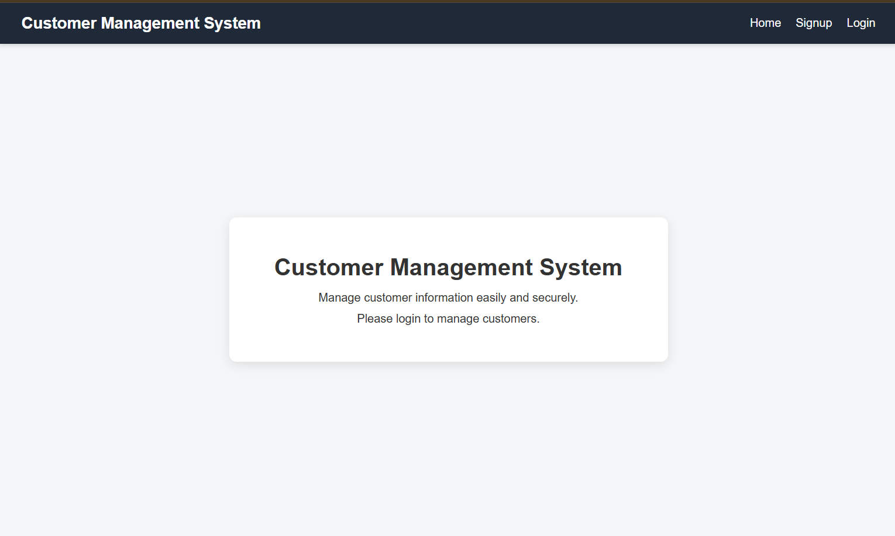

## 👤 Admin Home Page

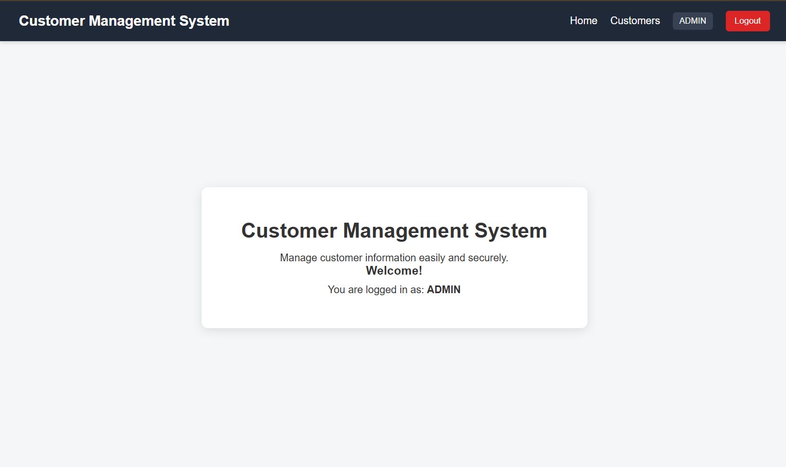

## 👤 User Home Page

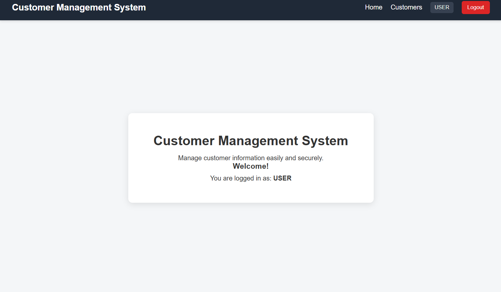

## 📝 Signup Page

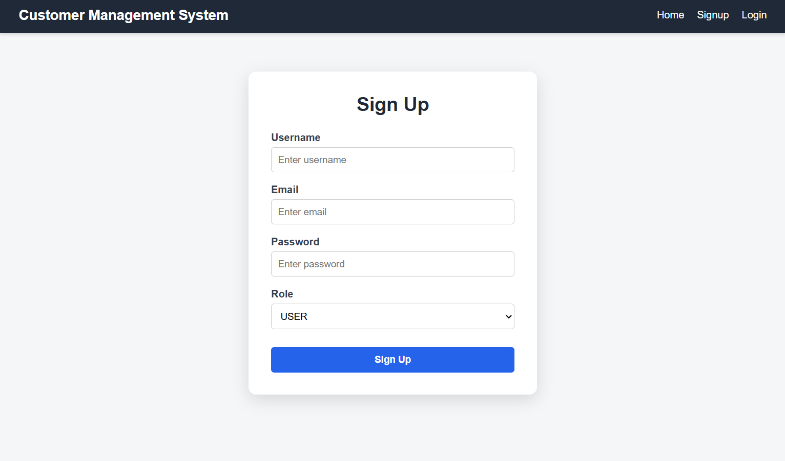

## 🔐 Login Page

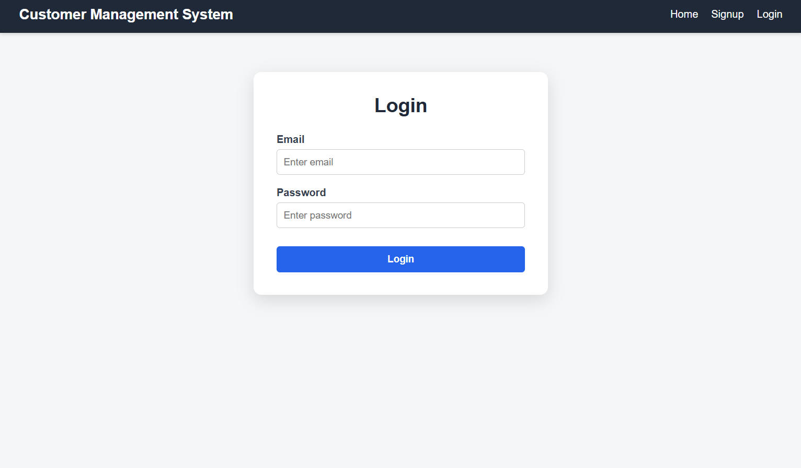

## 📋 Admin Customer List

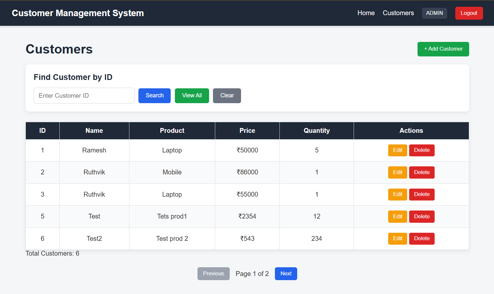

## 👀 User Customer List

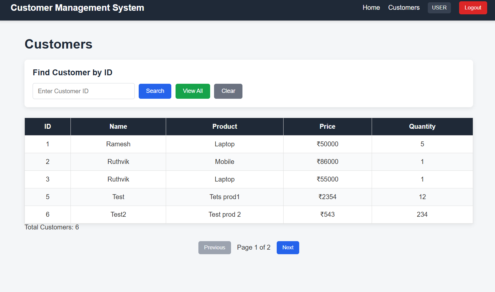

## 🔎 Search Customer by ID

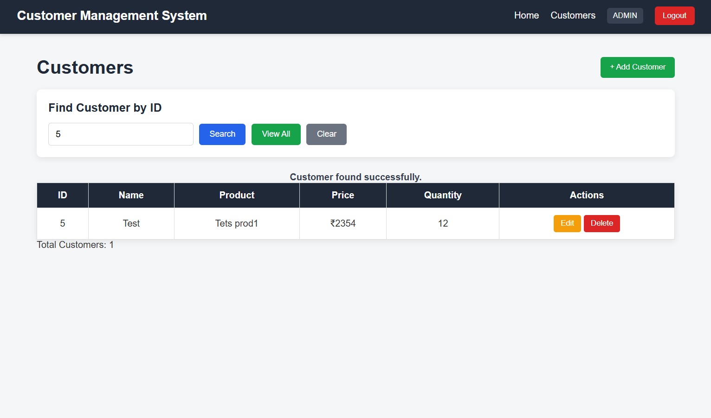

## ➕ Add Customer

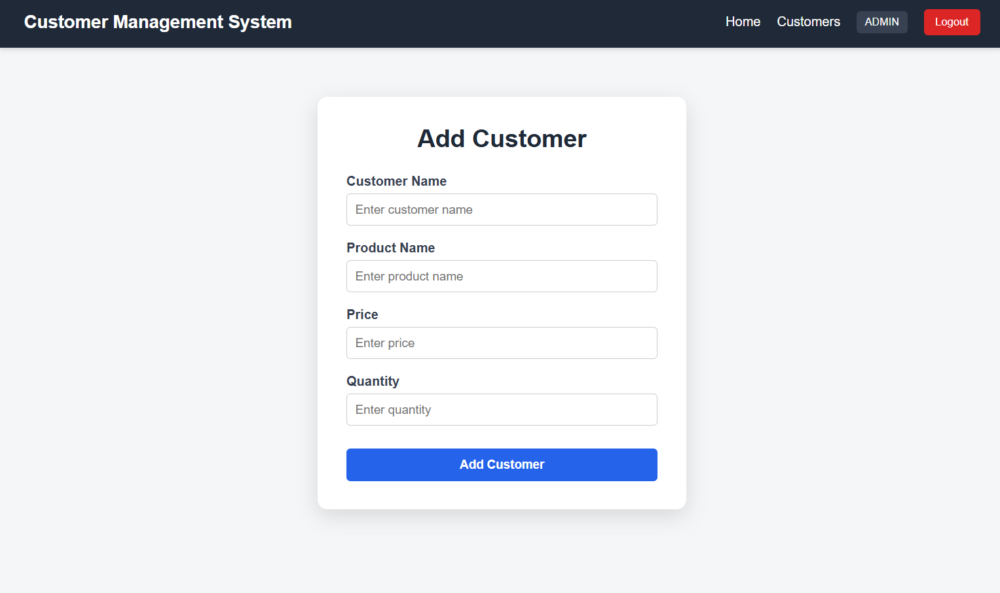

## ✏️ Edit Customer

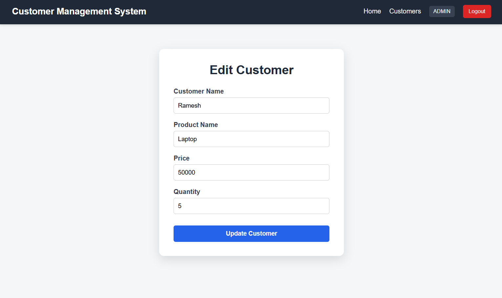

## 🗑️ Delete Customer

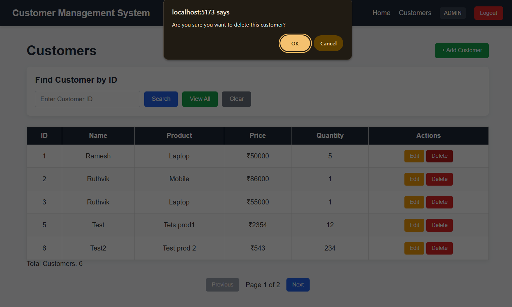

---

# 📌 Project Highlights

- Full-stack Customer Management System
- Spring Boot REST API
- React frontend
- MySQL database
- Customer CRUD operations
- Search customer by ID
- View All customers
- Pagination
- JWT authentication
- Spring Security
- Role-based authorization
- BCrypt password encryption
- Global exception handling
- Protected frontend routes
- Admin-only customer management
- Axios API integration
- Postman API testing
- Git and GitHub version control
- Separate backend and frontend development environments
- Backend developed using Eclipse
- Frontend developed using VS Code

---

# 🎯 Learning Outcomes

This project provided practical experience with:

- Java
- Spring Boot
- REST API Development
- Spring MVC
- Spring Data JPA
- Hibernate
- MySQL
- CRUD Operations
- React
- React Router
- Axios
- JWT Authentication
- Spring Security
- BCrypt
- Role-Based Authorization
- Exception Handling
- Pagination
- Postman API Testing
- Git and GitHub

---

# 📜 Conclusion

**CUST_CRUD** demonstrates a complete full-stack Customer Management System by integrating **React, Spring Boot, Spring Security, JWT, JPA/Hibernate, and MySQL**.

The application provides a centralized way to manage customer records with:

- CRUD operations
- Customer search by ID
- View All functionality
- Pagination
- Authentication
- Role-based authorization
- Exception handling

The application follows a layered backend architecture and separates the frontend and backend responsibilities while maintaining both modules in a single GitHub repository.

## Complete Application Flow

```text
User
  ↓
React Frontend
  ↓
Signup / Login
  ↓
JWT Authentication
  ↓
Home Page
  ↓
Customer Management
  ↓
Axios API Request
  ↓
Spring Security
  ↓
Controller
  ↓
Service
  ↓
Repository
  ↓
MySQL
  ↓
JSON Response
  ↓
React UI
```

---

# 👤 Author

**Ruthvik Reddy Anupati**

**Project:** CUST_CRUD – Customer Management System

**GitHub:**

```text
https://github.com/RuthvikAnupati/Customer_CRUD
```

---

# 📄 License

This project is created for **learning and educational purposes**.
```
